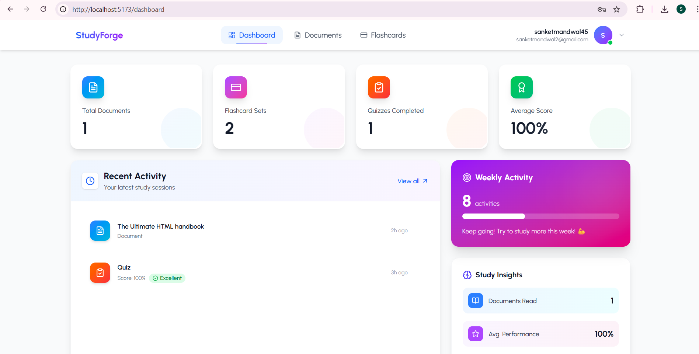
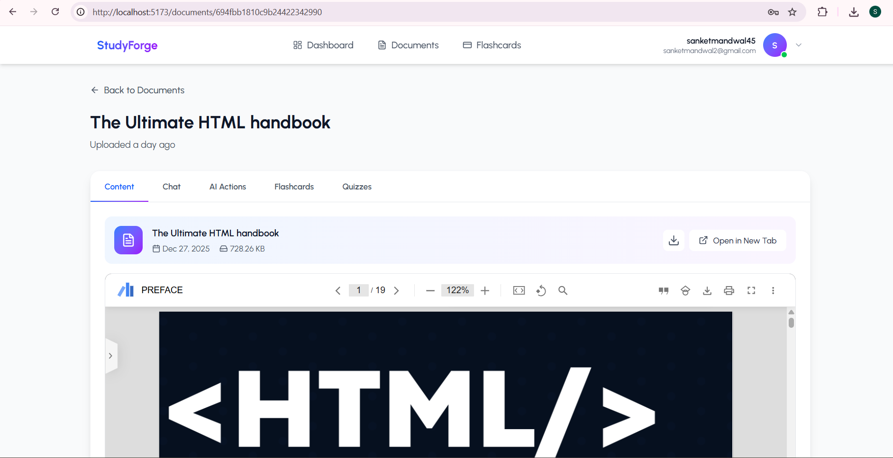
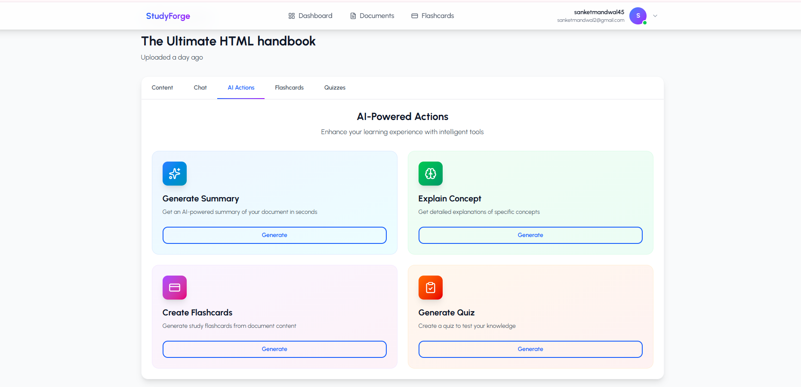
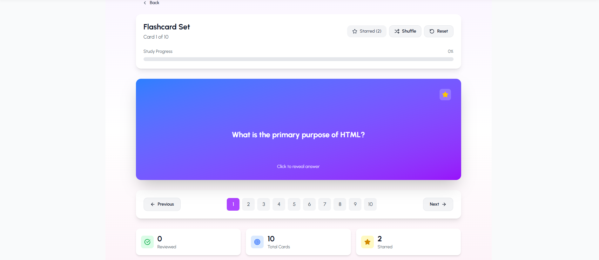
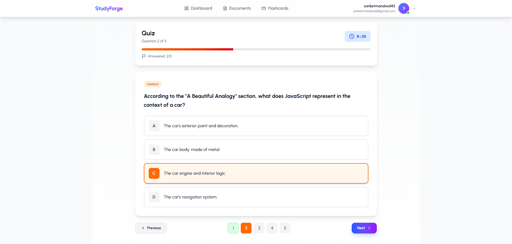

# StudyForge – AI-Powered Learning Assistant

StudyForge is an **AI-powered learning assistant platform** that converts static PDF documents into **interactive learning experiences**.
It allows users to upload PDFs and generate **summaries, quizzes, flashcards, and document-grounded chat responses** using **Google Gemini** and a **Retrieval-Augmented Generation (RAG)** architecture.

Built using the **MERN stack**, StudyForge focuses on reliability, scalability, and controlled use of Generative AI.

---

## 🚀 Key Features

### 📄 Document Processing
- Secure PDF upload with user-based access control.
- Asynchronous document processing with status tracking (`processing`, `ready`, `failed`).
- Automatic text extraction and intelligent chunking with overlap.

### 🧠 AI Teaching Assistant
- **Document Summarization**
- **Flashcard Generation** with difficulty levels
- **Quiz Generation** (MCQs with explanations)
- **Context-Aware Chatbot** (RAG-based)
- **Concept Explanation** grounded in document context

### 📊 Learning & Interaction Tracking
- Quiz attempts, scores, and answers tracking.
- Persistent chat history per document.
- User-specific ownership of all generated content.

### 🔐 Security & Reliability
- JWT-based authentication.
- Strict document ownership validation.
- Defensive parsing of AI-generated outputs.
- Token and context size control.

---

## 🧠 AI Architecture Overview

1. PDF Upload & Parsing
2. Text Cleaning & Chunking (with overlap)
3. Relevant Chunk Retrieval
4. LLM Generation using Gemini
5. Validation & Persistence

---

## 🛠 Tech Stack

- **Frontend**: React.js
- **Backend**: Node.js, Express.js
- **Database**: MongoDB
- **Authentication**: JWT
- **AI / LLM**: Google Gemini API
- **File Uploads**: Multer
- **PDF Parsing**: pdf-parse

---

## 📁 Project Structure

```
StudyForge/
├── Frontend/                         # Frontend (React)
├── Backend/                         # Backend (Node.js + Express)
│   ├── controllers/
│   ├── models/
│   ├── routes/
│   ├── utils/
│   ├── middleware/
│   └── config/
├── ScreenShots/
└── README.md
```

---

## ⚙️ Setup Instructions

### Prerequisites
- Node.js (v16+)
- MongoDB (cloud)

### Installation

1. Clone the repository
```bash
git clone https://github.com/Sanketmandwal/StudyForge.git
cd StudyForge
```

2. Configure environment variables
- Copy `.env.sample` to `.env` inside the `Backend/` directory.
- Add MongoDB URI, JWT Secret, and Gemini API Key.

3. Install dependencies

Backend:
```bash
cd Backend
npm install
```

Frontend:
```bash
cd Frontend
npm install
```

4. Run the application

Backend:
```bash
cd Backend
npm run dev
```

Frontend:
```bash
cd Frontend
npm start
```

5. Access the application
```
http://localhost:5173
```

---

## 📸 Screenshots

### Dashboard


### Upload Document


### AI Chat Interface


### AI Actions


### FlashCards


### Quizzes


---

## 🤝 Contributing

Contributions are welcome.

1. Fork the repository
2. Create a new branch
```bash
git checkout -b feature/your-feature-name
```
3. Commit your changes
```bash
git commit -m "Add feature"
```
4. Push to the branch
```bash
git push origin feature/your-feature-name
```
5. Open a pull request

---

## 📬 Contact

**Author**: Sanket Mandwal  
**GitHub**: https://github.com/Sanketmandwal  
**Email**: sanketmandwal2@gmail.com

---
